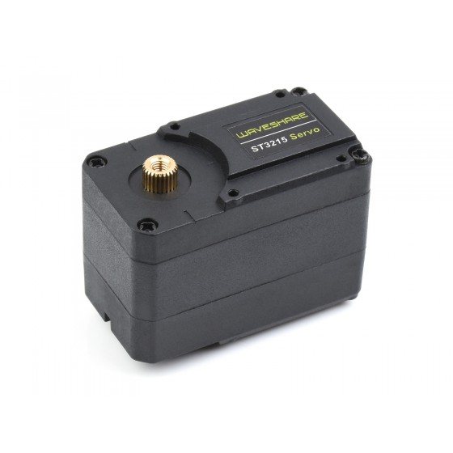

# Spot Micro 2024 - by Fred Robotic

---

## Intro

### La genèses du projet

Le projet SpotMircro à été initié

### SpotMircro dans l’association CALIBAN

---

## Version 2024

### Servo Moteur Waveshare ST3215

- Force de 30kg/cm
- Tension d'alimentation : 12Volt
- mouvement sur 360° ou rotation en continue

https://www.waveshare.com/st3215-servo.htm
https://www.waveshare.com/wiki/ST3215_Servo

### Nouvelle pièces mécaniques

ok ceci est un test

ok

